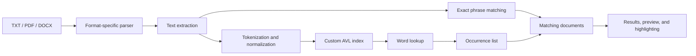

# Text Finder

Desktop document search built with JavaFX, custom data structures, and format-specific parsers.

Text Finder creates a local library of TXT, PDF, and DOCX documents, extracts their text, indexes normalized words in an AVL tree, and presents matching documents with an in-app preview. The project combines practical file processing with explicit implementations of balanced trees, linked lists, and sorting algorithms.

## Main Features

- Add individual documents or import supported files from a directory
- Parse plain text, PDF, and Microsoft Word documents
- Build a case-insensitive word index backed by a custom AVL tree
- Search indexed words and exact text phrases
- Preview matching documents with highlighted search terms
- Open a selected result in the operating system's default application
- Sort results by name, last-modified date, or file size
- Inspect clear empty, indexing, and result states in the JavaFX interface

## How It Works



Word searches use the AVL index. Each AVL node stores a custom linked list containing the word position and source document for every occurrence. Queries containing spaces or punctuation are treated as exact phrase searches against the extracted document text.

## Architecture / Indexing Flow

1. **Document library** — the JavaFX controller maintains the selected files in a custom generic linked list.
2. **Parsing** — `DocumentParser` delegates to the TXT, PDF, or DOCX parser.
3. **Indexing** — `Indizador` normalizes tokens and inserts them into `AVLTree`.
4. **Occurrences** — repeated words append their position and document path to `LinkedListOccurrences`.
5. **Search** — indexed word queries resolve through the AVL tree; phrase queries compare extracted text.
6. **Presentation** — matching files are displayed, sortable, previewable, and openable from the desktop UI.

## Data Structures & Algorithms

| Component | Purpose |
| --- | --- |
| AVL tree | Stores normalized words and keeps lookup depth balanced through left and right rotations |
| Occurrence linked list | Records every word position and originating document |
| Generic linked list | Stores the document library and ordered search results |
| Quick Sort | Orders result files alphabetically by name |
| Bubble Sort | Orders result files by last-modified timestamp |
| Radix Sort | Orders result files by file size |

The custom structures are kept intentionally because implementing and applying them is a central technical objective of the project.

## Supported Document Types

| Format | Parser |
| --- | --- |
| `.txt` | Java NIO with UTF-8 text decoding |
| `.pdf` | Apache PDFBox |
| `.docx` | Apache POI XWPF |

Only text that can be extracted by these libraries is indexed. Image-only scanned documents require OCR and are outside this project's scope.

## Tech Stack

- Java 21
- JavaFX 21
- Maven Wrapper
- Apache PDFBox 2
- Apache POI XWPF
- JUnit 5
- FXML and CSS

## Project Structure

```text
.
├── .mvn/wrapper/                 # Reproducible Maven wrapper
├── src/
│   ├── main/
│   │   ├── java/com/example/textfinder/
│   │   │   ├── AVLTree.java
│   │   │   ├── LinkedListLibrary.java
│   │   │   ├── LinkedListOccurrences.java
│   │   │   ├── DocumentParser.java
│   │   │   ├── Indizador.java
│   │   │   ├── *Parser.java
│   │   │   └── Interface_Controller.java
│   │   └── resources/com/example/textfinder/
│   │       ├── Textfinder.fxml
│   │       └── text-finder.css
│   └── test/java/com/example/textfinder/
├── pom.xml
├── mvnw
└── mvnw.cmd
```

## Setup

### Requirements

- JDK 21
- Git

Maven does not need to be installed globally; the repository includes the Maven Wrapper.

```bash
git clone https://github.com/Iagomez05/Text-Finder.git
cd Text-Finder
```

On macOS or Linux, make the wrapper executable if needed:

```bash
chmod +x mvnw
```

## Running the Application

Windows:

```powershell
.\mvnw.cmd clean javafx:run
```

macOS or Linux:

```bash
./mvnw clean javafx:run
```

## Usage

1. Select **Add document** or **Add folder** to create the local document library.
2. Select **Build index** to parse and index the current library. Searching also builds the index when required.
3. Enter a word or phrase and select **Search**.
4. Select a result to preview its extracted text and highlighted matches.
5. Sort the result list or open a selected document with its default desktop application.

The library and index live in memory for the current application session. Original documents are read from their existing locations and are not copied or modified.

## Testing

Run the focused test suite and package the application:

```powershell
.\mvnw.cmd clean test
.\mvnw.cmd clean package
```

The tests cover:

- AVL insertion, lookup, occurrence storage, and balance
- TXT, PDF, and DOCX text extraction
- normalized document indexing and lookup
- Quick Sort, Bubble Sort, and Radix Sort behavior

## Contributors

Text Finder was developed collaboratively by **Ian Gómez** and project teammates as part of the Computer Engineering curriculum at Tecnológico de Costa Rica.

## Academic Context

This project originated in an Algorithms and Data Structures course during the first semester of 2024. It was later refined for clearer setup, stronger document-processing behavior, focused automated validation, and professional technical documentation while preserving the original custom data structures and desktop architecture.
